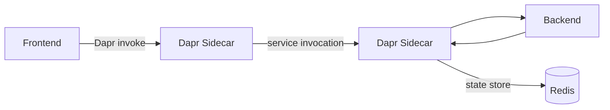

# 08 Multi-Container & Dapr

## Goal

Enable Dapr on the Container Apps environment to provide service-to-service
invocation between the frontend and backend, and add a Redis state store
component for persisting patient triage data.

## Estimated time

20 minutes.

## Official references

- [Dapr integration with Container Apps](https://learn.microsoft.com/azure/container-apps/dapr-overview)
- [Dapr service invocation](https://learn.microsoft.com/azure/container-apps/dapr-service-invocation)
- [Dapr state store component](https://learn.microsoft.com/azure/container-apps/dapr-component-connection)
- [Connect to Azure Cache for Redis](https://learn.microsoft.com/azure/container-apps/dapr-component-connection?tabs=bash&pivots=azure-cache-for-redis)

## Key concepts

| Concept | Purpose |
|---------|---------|
| **Dapr** | Distributed Application Runtime — sidecar-based building blocks. |
| **Service invocation** | Call other services by name without knowing their URL. |
| **State store** | Persist key-value data via a pluggable component (Redis, Cosmos DB). |
| **Component** | A Dapr configuration that binds to an external resource. |

## Architecture



## Exercise

### Step 1 — Create an Azure Cache for Redis

```bash
export REDIS_NAME=redis-triage-$RANDOM

az redis create \
  --name $REDIS_NAME \
  --resource-group $RESOURCE_GROUP \
  --location $LOCATION \
  --sku Basic \
  --vm-size c0
```

Wait for provisioning (a few minutes), then get the connection details:

```bash
REDIS_HOST=$(az redis show --name $REDIS_NAME --resource-group $RESOURCE_GROUP --query hostName -o tsv)
REDIS_KEY=$(az redis list-keys --name $REDIS_NAME --resource-group $RESOURCE_GROUP --query primaryKey -o tsv)
REDIS_PORT=6380
```

### Step 2 — Enable Dapr on the backend

```bash
az containerapp dapr enable \
  --name triage-backend \
  --resource-group $RESOURCE_GROUP \
  --dapr-app-id triage-backend \
  --dapr-app-port 8000 \
  --dapr-app-protocol http
```

### Step 3 — Enable Dapr on the frontend

```bash
az containerapp dapr enable \
  --name triage-frontend \
  --resource-group $RESOURCE_GROUP \
  --dapr-app-id triage-frontend \
  --dapr-app-port 80 \
  --dapr-app-protocol http
```

### Step 4 — Create the Redis state store component

```bash
az containerapp env dapr-component set \
  --name $CONTAINERAPPS_ENVIRONMENT \
  --resource-group $RESOURCE_GROUP \
  --dapr-component-name statestore \
  --yaml - <<EOF
componentType: state.redis
version: v1
metadata:
  - name: redisHost
    value: "${REDIS_HOST}:${REDIS_PORT}"
  - name: redisPassword
    value: "${REDIS_KEY}"
  - name: enableTLS
    value: "true"
scopes:
  - triage-backend
EOF
```

### Step 5 — Test service invocation

Dapr allows calling the backend by its app ID instead of a URL. From within
the environment, the frontend can call:

```
http://localhost:3500/v1.0/invoke/triage-backend/method/api/health
```

Test via exec:

```bash
az containerapp exec \
  --name triage-frontend \
  --resource-group $RESOURCE_GROUP \
  --command -- curl -s http://localhost:3500/v1.0/invoke/triage-backend/method/api/health
```

### Step 6 — Test the state store

Save and retrieve state via Dapr:

```bash
az containerapp exec \
  --name triage-backend \
  --resource-group $RESOURCE_GROUP \
  --command -- sh -c '
    curl -s -X POST http://localhost:3500/v1.0/state/statestore \
      -H "Content-Type: application/json" \
      -d "[{\"key\":\"patient-001\",\"value\":{\"name\":\"Jane Doe\",\"urgency\":\"High\"}}]"
    echo ""
    curl -s http://localhost:3500/v1.0/state/statestore/patient-001
  '
```

### Step 7 — List Dapr components

```bash
az containerapp env dapr-component list \
  --name $CONTAINERAPPS_ENVIRONMENT \
  --resource-group $RESOURCE_GROUP \
  -o table
```

## What this lab demonstrates

1. Enabling Dapr sidecars on Container Apps.
2. Service-to-service invocation by app ID.
3. Pluggable state management with Redis.
4. Dapr component configuration in Container Apps.
5. Benefits: service discovery, retries, and observability — without code changes.

## Expected result

Both apps have Dapr sidecars. The frontend can invoke the backend via Dapr
service invocation. Patient data can be persisted to Redis via the Dapr state
store.

## Verification

- [ ] `az containerapp show --name triage-backend ... --query properties.configuration.dapr` shows Dapr enabled.
- [ ] Service invocation via `localhost:3500` returns the health check.
- [ ] State store write and read returns `{"name":"Jane Doe","urgency":"High"}`.
- [ ] `az containerapp env dapr-component list` shows the `statestore` component.
