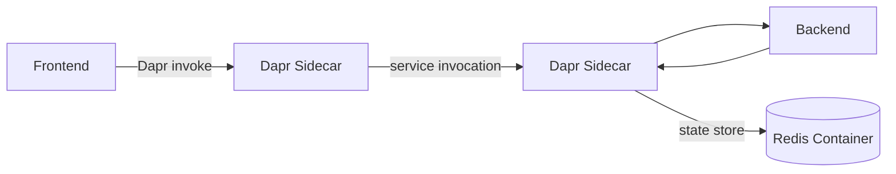

# 08 Multi-Container & Dapr

## Goal

Enable Dapr on the Container Apps environment to provide service-to-service
invocation between the frontend and backend, and add a Redis state store
component for persisting patient triage data.

## Estimated time

20 minutes.

## Official references

- [Dapr integration with Container Apps](https://learn.microsoft.com/azure/container-apps/dapr-overview)
- [Dapr service invocation](https://learn.microsoft.com/azure/container-apps/dapr-service-invocation)
- [Dapr state store component](https://learn.microsoft.com/azure/container-apps/dapr-component-connection)
- [Container Apps as Dapr component backends](https://learn.microsoft.com/azure/container-apps/dapr-component-connection)

## Key concepts

| Concept | Purpose |
|---------|---------|
| **Dapr** | Distributed Application Runtime — sidecar-based building blocks. |
| **Service invocation** | Call other services by name without knowing their URL. |
| **State store** | Persist key-value data via a pluggable component (Redis, Cosmos DB). |
| **Component** | A Dapr configuration that binds to an external resource. |

## Architecture



## Exercise

### Step 1 — Deploy a Redis container

Instead of provisioning a managed Azure Cache for Redis (which takes 15+
minutes), deploy Redis as a Container App in the same environment. This is
instant and keeps everything self-contained:

```bash
source .env

az containerapp create \
  --name redis \
  --resource-group $RESOURCE_GROUP \
  --environment $CONTAINERAPPS_ENVIRONMENT \
  --image docker.io/redis:7-alpine \
  --target-port 6379 \
  --ingress internal \
  --min-replicas 1 \
  --max-replicas 1 \
  --cpu 0.25 \
  --memory 0.5Gi
```

Get the internal FQDN:

```bash
REDIS_HOST=$(az containerapp show \
  --name redis \
  --resource-group $RESOURCE_GROUP \
  --query properties.configuration.ingress.fqdn -o tsv)

echo "Redis FQDN: $REDIS_HOST"
```

!!! tip "Production: use Azure Cache for Redis"
    For a workshop, a Redis container is fast and free. In production, use
    [Azure Cache for Redis](https://learn.microsoft.com/azure/azure-cache-for-redis/cache-overview)
    or [Azure Managed Redis](https://learn.microsoft.com/azure/azure-cache-for-redis/managed-redis-overview)
    for durability, TLS, backups, and an SLA.

    The beauty of Dapr is that **switching is a config change, not a code
    change**. Just update the component metadata to point at the managed
    service — add `enableTLS: "true"`, swap the host/password, and your
    app code stays identical. This same pluggability works with Cosmos DB,
    Azure SQL, Service Bus, Event Hubs, and other Azure PaaS services.

### Step 2 — Enable Dapr on the backend

```bash
az containerapp dapr enable \
  --name triage-backend \
  --resource-group $RESOURCE_GROUP \
  --dapr-app-id triage-backend \
  --dapr-app-port 8000 \
  --dapr-app-protocol http
```

### Step 3 — Enable Dapr on the frontend

```bash
az containerapp dapr enable \
  --name triage-frontend \
  --resource-group $RESOURCE_GROUP \
  --dapr-app-id triage-frontend \
  --dapr-app-port 80 \
  --dapr-app-protocol http
```

### Step 4 — Create the Redis state store component

Save the component definition to a file and apply it:

```bash
cat > /tmp/statestore.yaml <<EOF
componentType: state.redis
version: v1
metadata:
  - name: redisHost
    value: "${REDIS_HOST}:6379"
  - name: enableTLS
    value: "false"
scopes:
  - triage-backend
EOF

az containerapp env dapr-component set \
  --name $CONTAINERAPPS_ENVIRONMENT \
  --resource-group $RESOURCE_GROUP \
  --dapr-component-name statestore \
  --yaml /tmp/statestore.yaml
```

!!! note
    The Redis container has no password and no TLS — fine for a workshop.
    For a managed Azure Cache for Redis you would add `enableTLS: "true"`,
    use port `6380`, and provide the access key via a Container Apps secret.

### Step 5 — Test service invocation

Dapr allows calling other services by app ID instead of a URL. Each sidecar
listens on `localhost:3500` and routes via the mesh. Exec into the **backend**
and invoke itself through Dapr to confirm the sidecar is working:

```bash
az containerapp exec \
  --name triage-backend \
  --resource-group $RESOURCE_GROUP \
  --command "curl -s http://localhost:3500/v1.0/invoke/triage-backend/method/api/health"
```

You should see the health check JSON response, confirming that Dapr service
invocation is working.

### Step 6 — Test the state store

Save and retrieve state via Dapr:

```bash
az containerapp exec \
  --name triage-backend \
  --resource-group $RESOURCE_GROUP \
  --command "sh -c 'curl -s -X POST http://localhost:3500/v1.0/state/statestore -H \"Content-Type: application/json\" -d \"[{\\\"key\\\":\\\"patient-001\\\",\\\"value\\\":{\\\"name\\\":\\\"Jane Doe\\\",\\\"urgency\\\":\\\"High\\\"}}]\" && echo && curl -s http://localhost:3500/v1.0/state/statestore/patient-001'"
```

### Step 7 — List Dapr components

```bash
az containerapp env dapr-component list \
  --name $CONTAINERAPPS_ENVIRONMENT \
  --resource-group $RESOURCE_GROUP \
  -o table
```

## What this lab demonstrates

1. Enabling Dapr sidecars on Container Apps.
2. Service-to-service invocation by app ID.
3. Pluggable state management with Redis.
4. Dapr component configuration in Container Apps.
5. Benefits: service discovery, retries, and observability — without code changes.

## Expected result

Both apps have Dapr sidecars. The frontend can invoke the backend via Dapr
service invocation. Patient data can be persisted to Redis via the Dapr state
store.

## Verification

- [ ] `az containerapp show --name triage-backend ... --query properties.configuration.dapr` shows Dapr enabled.
- [ ] Service invocation via `localhost:3500` returns the health check.
- [ ] State store write and read returns `{"name":"Jane Doe","urgency":"High"}`.
- [ ] `az containerapp env dapr-component list` shows the `statestore` component.
