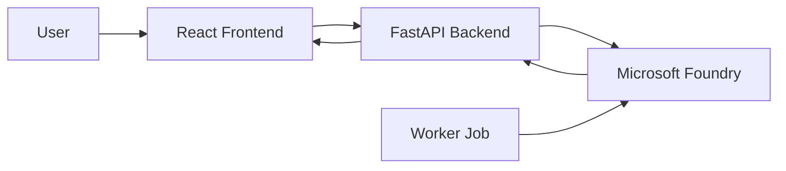

# Azure Container Workshop

Welcome to a docs-first Azure container workshop for beginners covering
**Azure Kubernetes Service (AKS)** and **Azure Container Apps**.

The examples use a lightweight healthcare **Patient Triage Assistant** scenario
so the workshop stays consistent across deployment, scaling, networking,
observability, and job labs. The demo app uses Python/FastAPI for the backend
and React for the frontend, with a model deployed in Microsoft Foundry
powering AI-based patient urgency classification.

Workshop source repository: [beyondelastic/azure-container-workshop](https://github.com/beyondelastic/azure-container-workshop)

This workshop is intentionally small, practical, and tied to official Microsoft
documentation. Each section includes:

- a clear goal
- official reference links
- step-by-step exercises with CLI commands
- expected results
- a short verification checklist

### Official by default

Every core exercise is mapped to Microsoft Learn or official Azure
documentation.

### Built for beginners

Each exercise is small, verifiable, and sequenced so the workshop can be taught
live or followed alone.

## What this workshop covers

| # | Lesson | Section |
|---|--------|---------|
| 00 | Prerequisites | — |
| 01 | Your First AKS Deployment | AKS |
| 02 | Services & Networking | AKS |
| 03 | Scaling & Configuration | AKS |
| 04 | Monitoring & Observability | AKS |
| 05 | AKS Automatic | AKS |
| 06 | Your First Container App | Container Apps |
| 07 | Scaling & Revisions | Container Apps |
| 08 | Multi-Container & Dapr | Container Apps |
| 09 | Jobs & Background Processing | Container Apps |

## Design goals

- Keep the flow easy to follow.
- Favour official documentation over custom theory.
- Keep examples short and runnable.
- Use a lightweight docs-first web UI.

## Demo app: Patient Triage Assistant



The **Patient Triage Assistant** accepts patient symptoms, sends them to a
model in Microsoft Foundry for urgency classification (Critical / High / Medium / Low), and
displays a color-coded triage queue. A background worker demonstrates batch
processing for Container Apps Jobs.

## Official sources used

- [AKS documentation](https://learn.microsoft.com/azure/aks/)
- [Azure Container Apps documentation](https://learn.microsoft.com/azure/container-apps/)
- [AKS Automatic overview](https://learn.microsoft.com/azure/aks/aks-automatic-overview)
- [Dapr on Container Apps](https://learn.microsoft.com/azure/container-apps/dapr-overview)
- [Container Apps Jobs](https://learn.microsoft.com/azure/container-apps/jobs)
- [Azure Container Registry](https://learn.microsoft.com/azure/container-registry/)

## Repository layout

```
.
├── docs/                  ← lesson pages (served by MkDocs)
├── app/
│   ├── backend/           ← Python FastAPI service
│   ├── frontend/          ← React (Vite) UI
│   └── worker/            ← Python batch worker
├── manifests/
│   ├── aks/               ← Kubernetes YAML manifests
│   └── container-apps/    ← Bicep templates
├── mkdocs.yml
├── requirements.txt
└── SETUP.md
```

## Quick start

1. Create a Python virtual environment.
2. Install dependencies.
3. Sign in to Azure.
4. Copy `.env.example` to `.env` and fill in your values.
5. Start the docs UI with `mkdocs serve`.

Detailed steps are in `SETUP.md`.

## Run the workshop UI

```bash
mkdocs serve
```

Then open the local URL shown in the terminal, usually `http://127.0.0.1:8000`.
